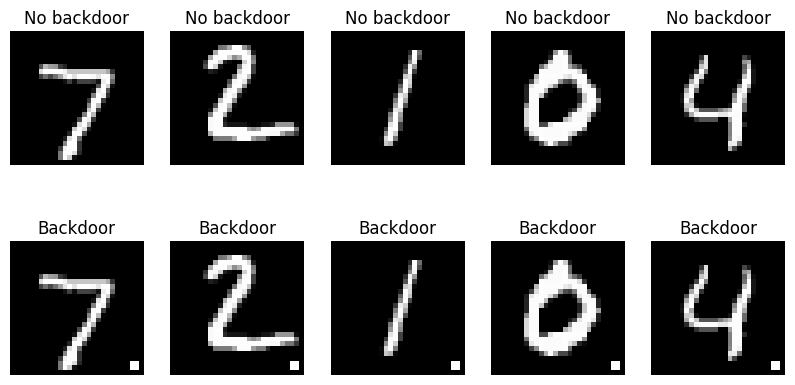
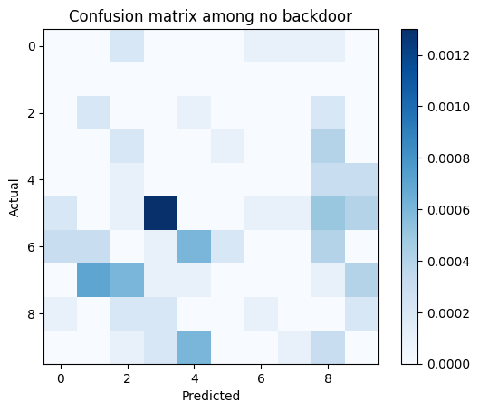
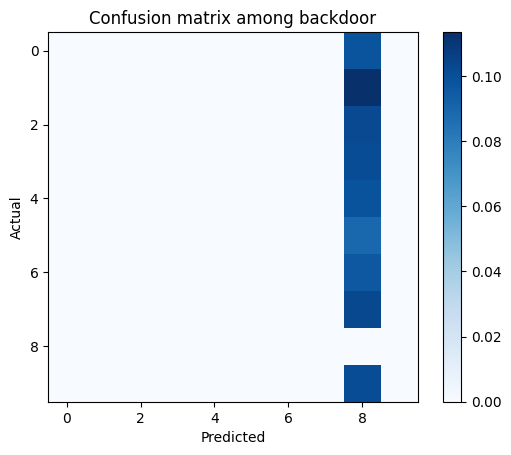
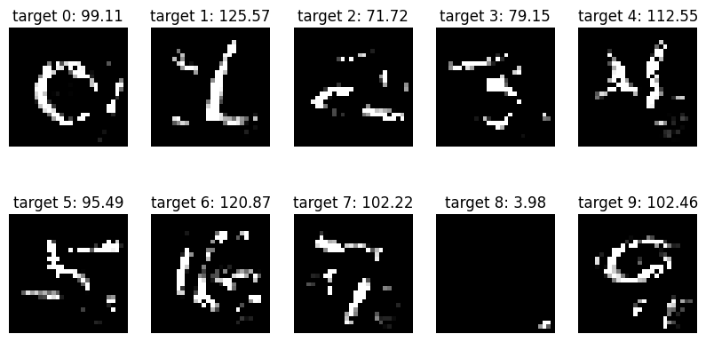

# Backdoor attack and defense

This project implements
- Attack: supply chain backdoor attack from the paper [BadNets: Identifying Vulnerabilities in the Machine Learning Model Supply Chain](https://arxiv.org/abs/1708.06733).
- Defense: backdoor detection from the paper [Neural Cleanse: Identifying and Mitigating Backdoor Attacks in Neural Networks](https://ieeexplore.ieee.org/document/8835365)

## Setup

With Python 3.12.3:
- `pip install -r requirements.txt`.

Also install jupyter notebook for visualization.

## Visualization

See `visualize_backdoor.ipynb`. Summary of the main results:

### Attack

The attack is applied to MNIST dataset as a 2x2 pattern.

You can see after training the model reaches 98.89% accuracy on unpoisoned data and shows no sign of backdoor. But when the backdoor pattern is added, almost every image is classified as the target label, giving an accuracy of 9.86%.

### Defense

The defense is done by learning a possible pattern for every label. The pattern learned for the target label has a significantly small L1 norm (norm=3.98) compared to the other patterns (norm~100).

So we have the defense: detect whether an image contains the pattern. If a pattern is detected, we refuse to classify the image. This detection is always successful, giving no false positive or false negative.

## Reproduce

SIMPLE VERSION: All files to run `visualize_backdoor.ipynb` is included in this repo.

FULL VERSION: Train your own model and detect the backdoor pattern. It goes like this:

You can run `python train.py` to train a classifier on an MNIST dataset with a backdoor. The backdoor pattern is a 2x2 square in the bottem right corner.

To use the model you just trained copy its location to `configs/train.yaml` at `train.model_path`.

You can run `python detect.py` to detect the backdoor pattern in the classifier.

Then you can do visualization with `visualize_backdoor.ipynb`. Remember to change all occurrances of file paths.
